## Technical Specifications
 
- **Language**: Java
- **Platform**: Android
- **Development Environment**: Android Studio
- **Architecture**: Standard Android application framework with Firebase database support
 

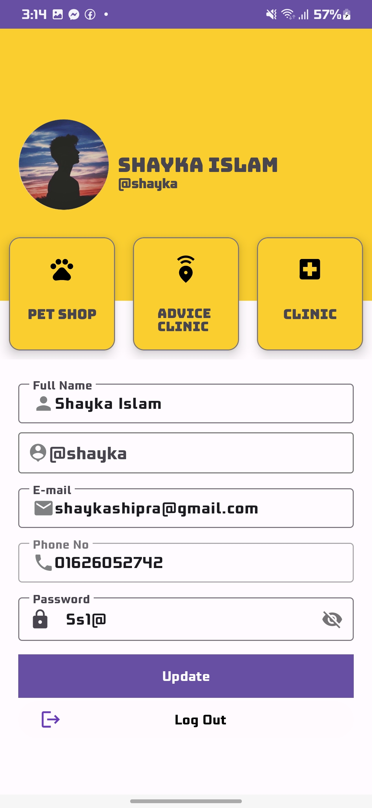
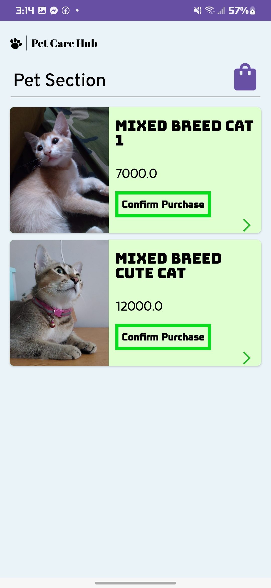
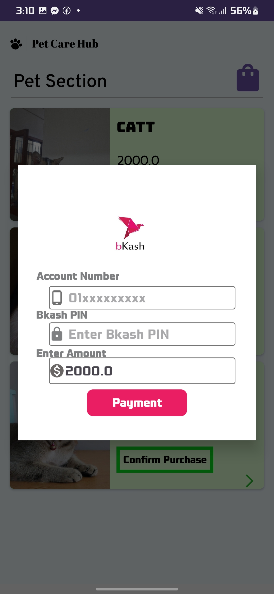
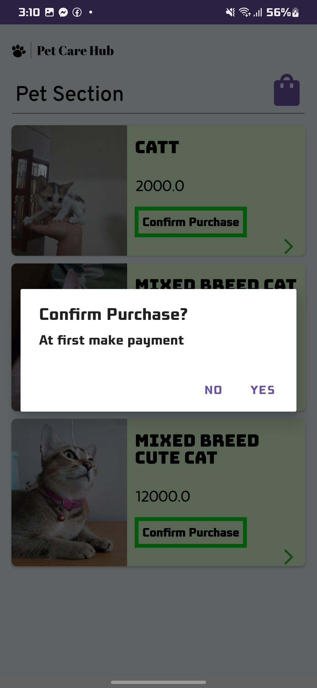
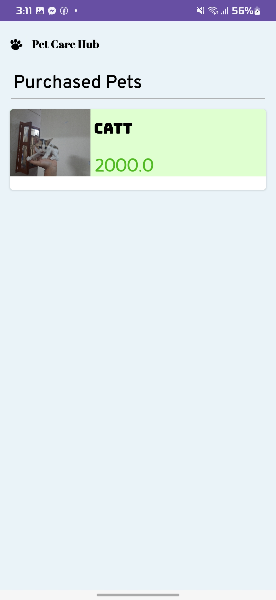
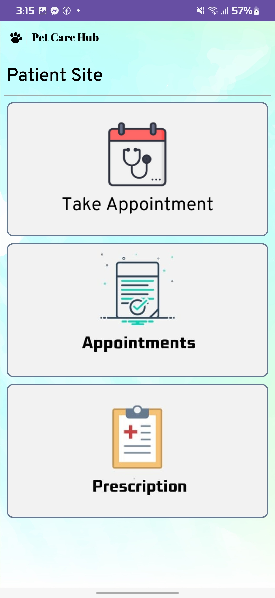

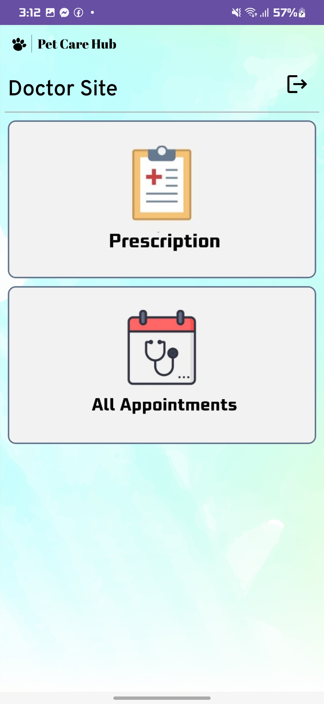
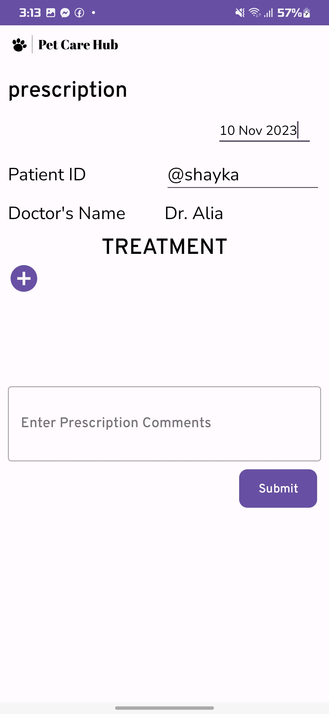
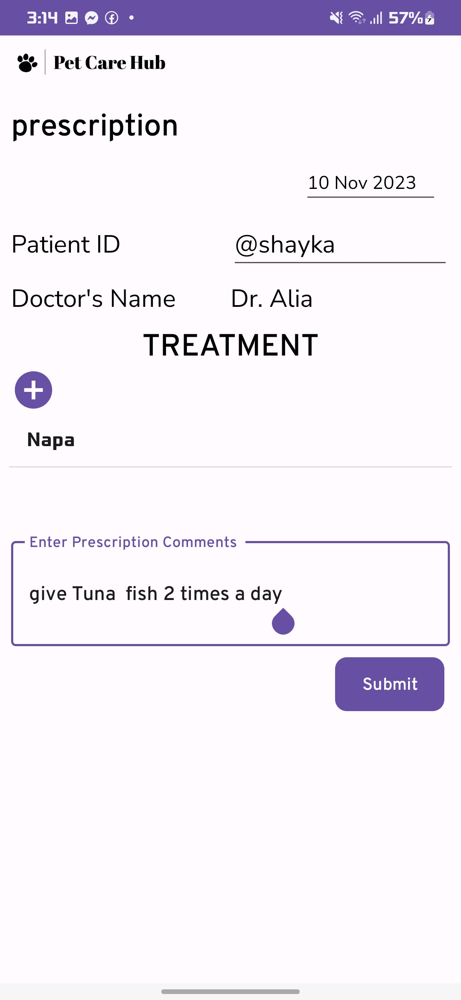
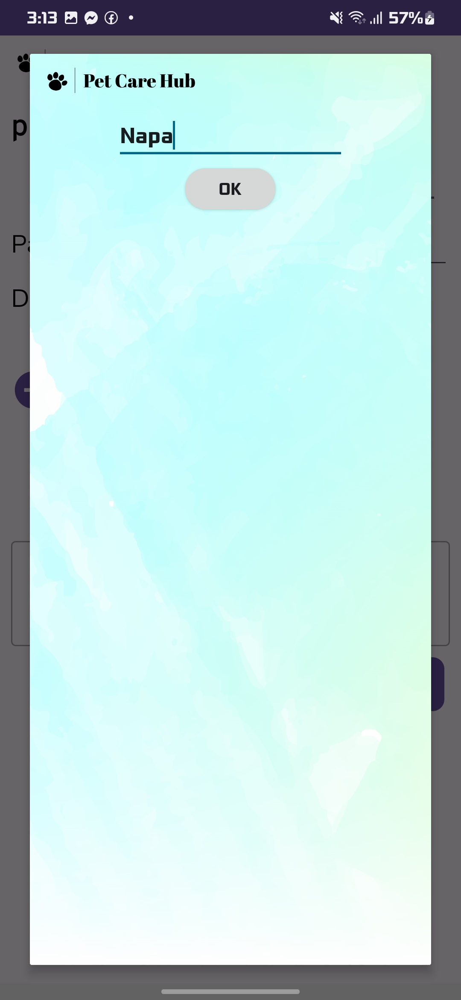
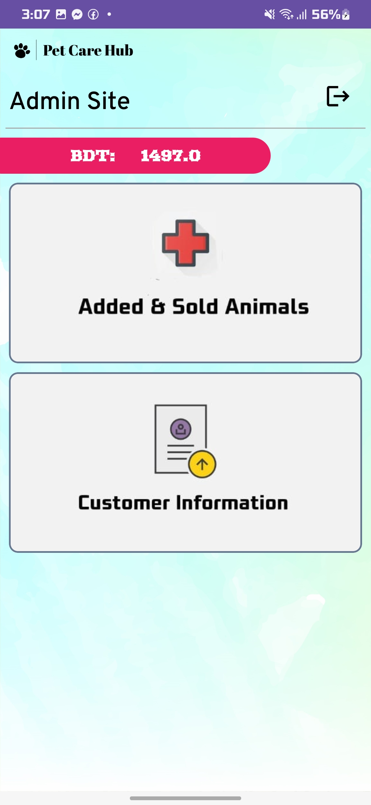
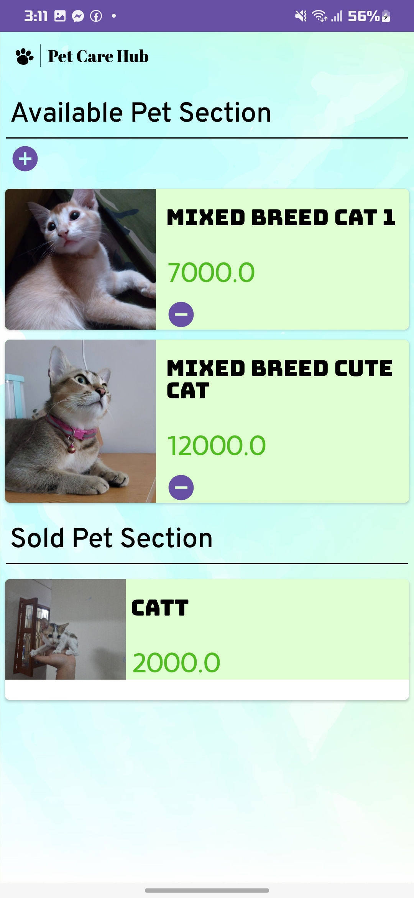
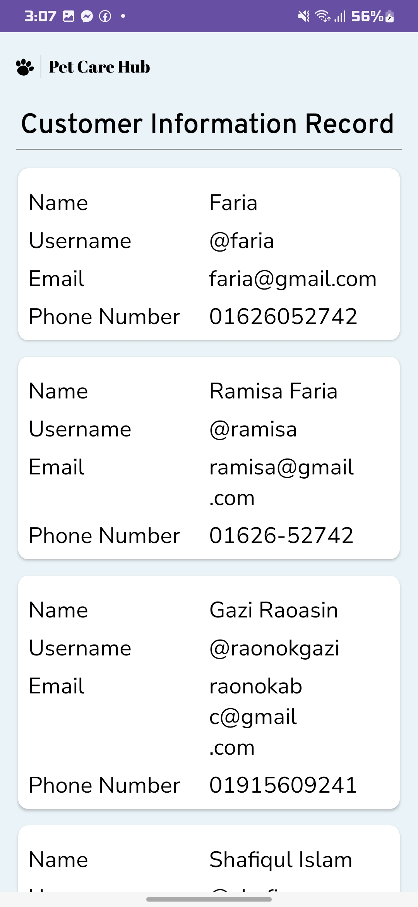
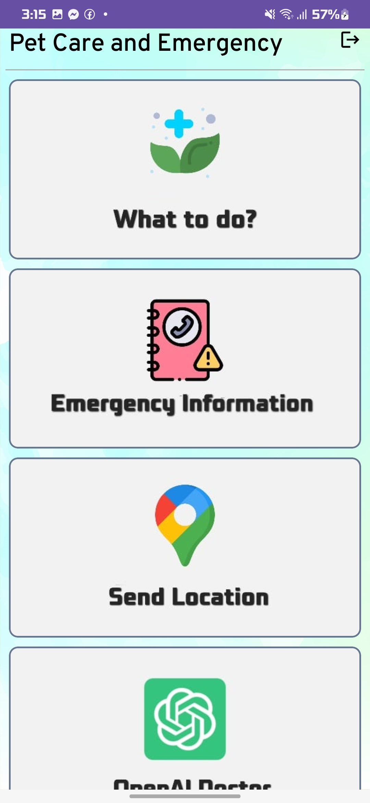
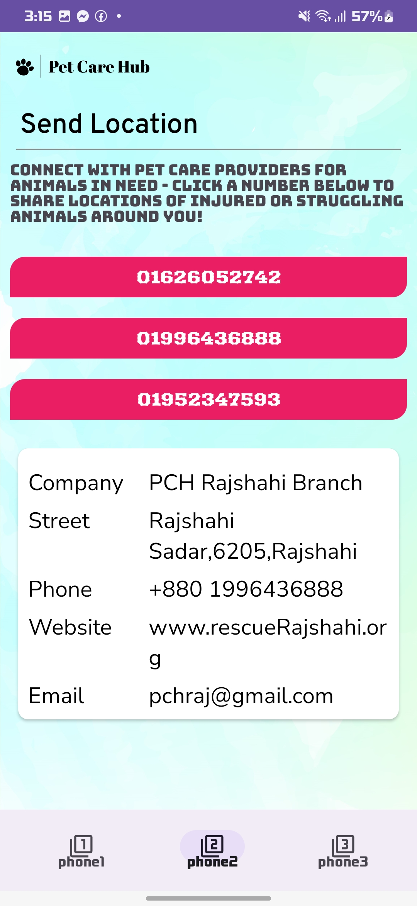
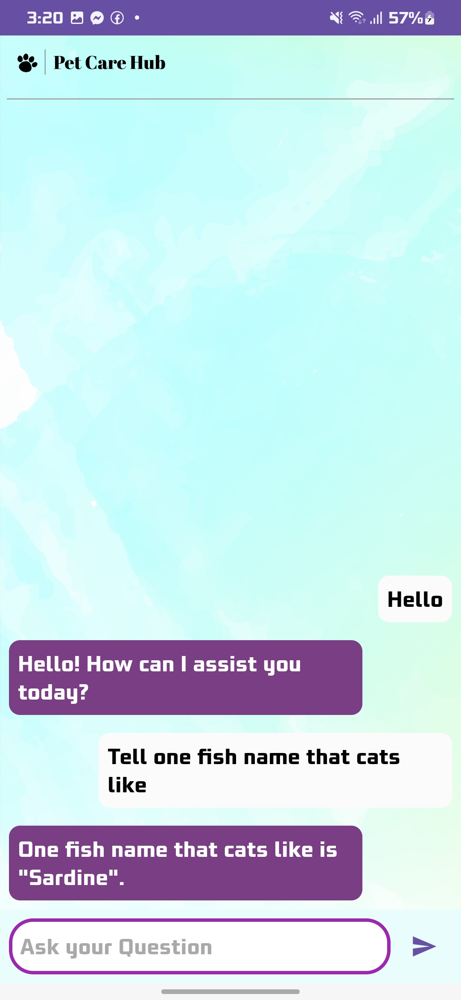
