# Pet Care Hub Android Application

A comprehensive Android application designed to provide an all-in-one platform for pet owners. The app integrates various essential services including veterinary clinics, pet shops, emergency services, and AI-assisted support to ensure the well-being of your pets.

## 🌟 Features

- **User Authentication**: Secure Login and Sign-Up integrated with Firebase Authentication. Includes distinct roles for Users, Admins, and Clinic Doctors.
- **Pet Management**: Dedicated section to view, adopt, and manage pet profiles.
- **Veterinary Clinics**: Browse and book appointments with nearby veterinary clinics and specialized doctors.
- **Emergency Services**: Quick access to emergency contacts and nearby emergency vet care, utilizing Google Maps Platform for real-time location.
- **Grocery & Pet Shop**: An integrated marketplace to purchase pet food, toys, and accessories.
- **AI Integration**: Experimental OpenAI integration (via OkHttp) for smart chat assistance regarding pet care.
- **Admin Dashboard**: Specialized tools for administrators to manage clinics, shops, and user data.

## 🛠️ Technology Stack

- **Platform**: Android (Java / Kotlin)
- **Minimum SDK**: 23
- **Target SDK**: 34
- **Architecture & UI**: ViewBinding, Material Design Components (MDC), ConstraintLayout, Navigation Component
- **Backend & Database**: Firebase (Realtime Database, Storage, Auth)
- **APIs & Services**: Google Maps Platform, Google Location Services, OpenAI API
- **Networking & Image Loading**: Volley, OkHttp, Picasso

## 🚀 Getting Started

### Prerequisites

- Android Studio (Electric Eel or newer recommended)
- Java 8 or higher
- A Firebase project with Authentication, Realtime Database, and Storage enabled.
- A Google Maps API key.

### Installation

1. Clone this repository:
   ```bash
   git clone https://github.com/your-username/your-repo-name.git
   ```
2. Open the project in Android Studio.
3. Configure **Firebase**:
   - Create a project on the [Firebase Console](https://console.firebase.google.com/).
   - Add an Android app and download the `google-services.json` file.
   - Place the `google-services.json` file in the `app/` directory of the project.
4. Configure **Google Maps**:
   - Obtain an API key from the [Google Cloud Console](https://console.cloud.google.com/).
   - Add your API key to your project's `local.properties` file or strings resources depending on your setup.
5. Build and run the application on an emulator or physical device.

## 🤝 Contributing

Contributions, issues, and feature requests are welcome! Feel free to check the issues page.

## 📄 License

This project is licensed under the MIT License.

 

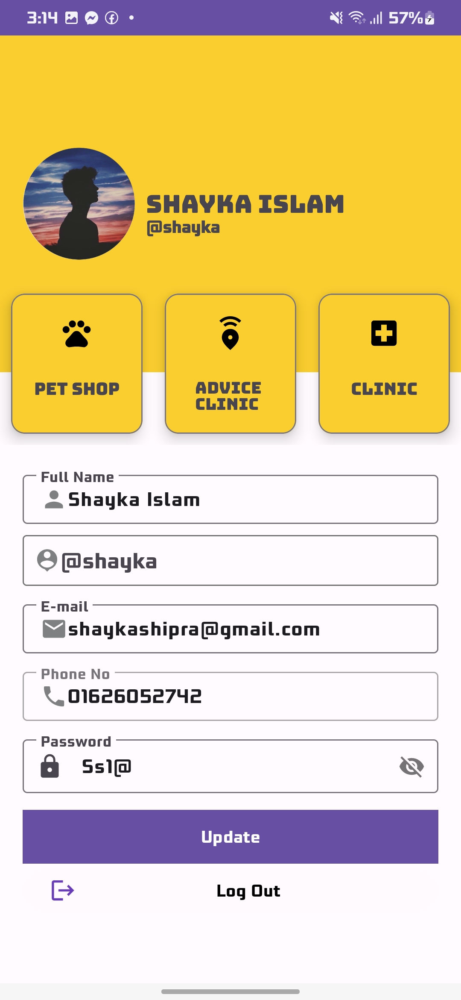
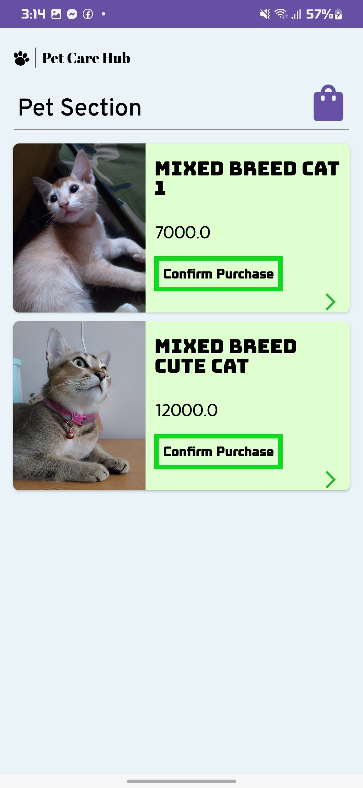
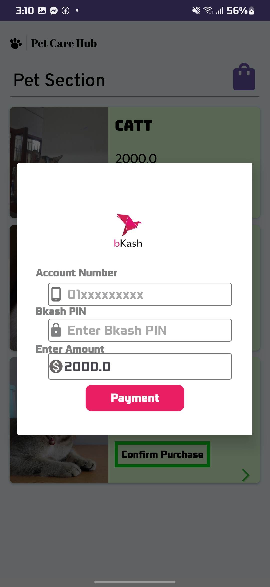
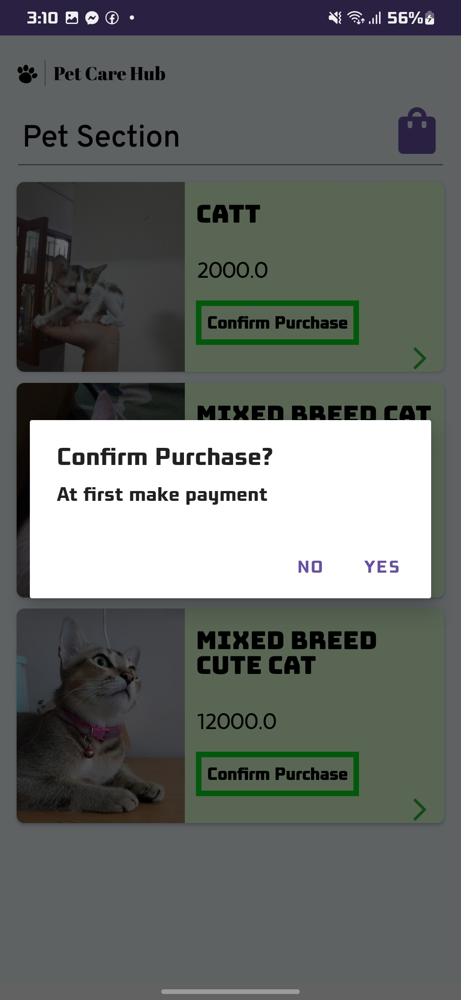
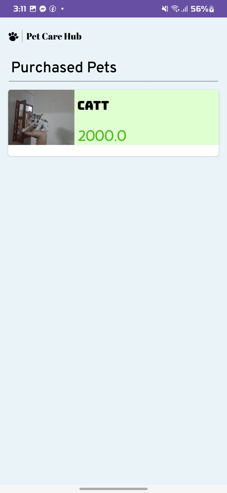
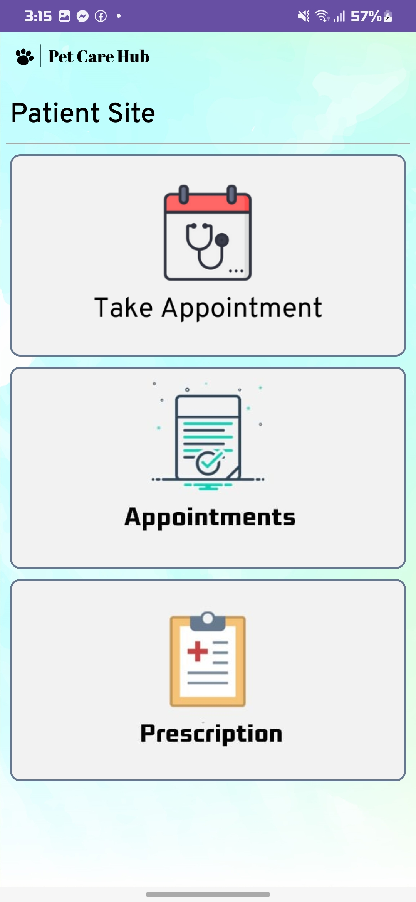
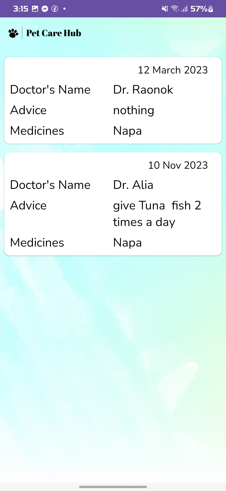
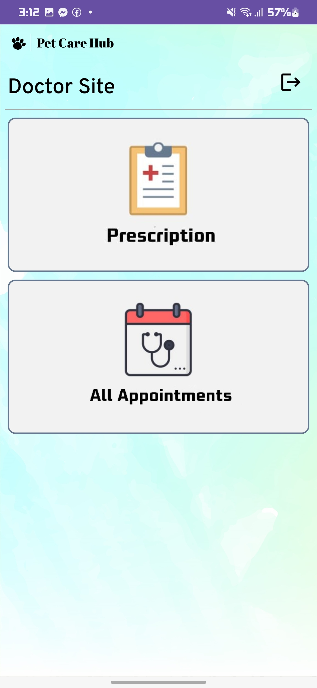
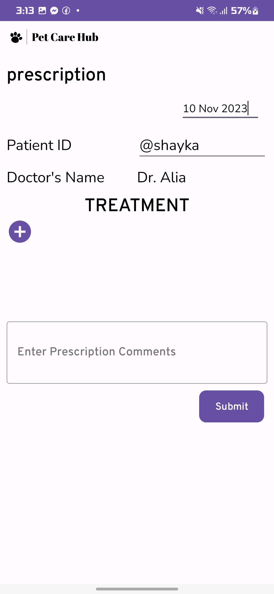
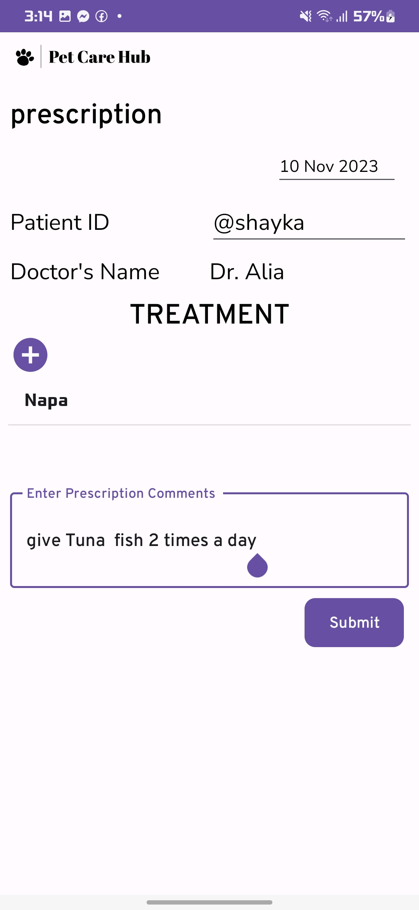
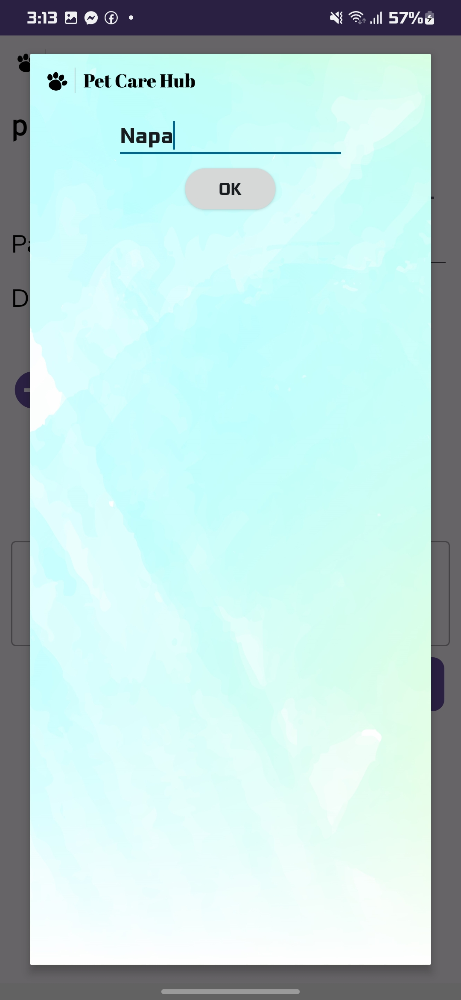
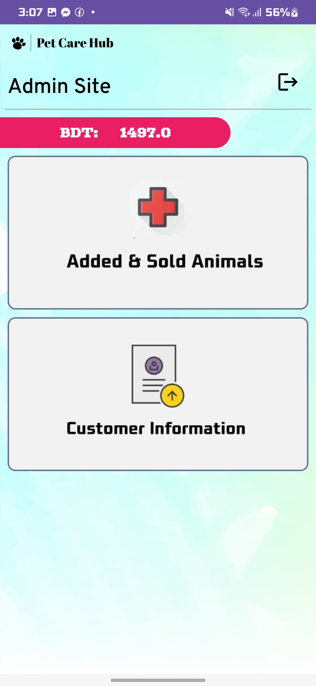
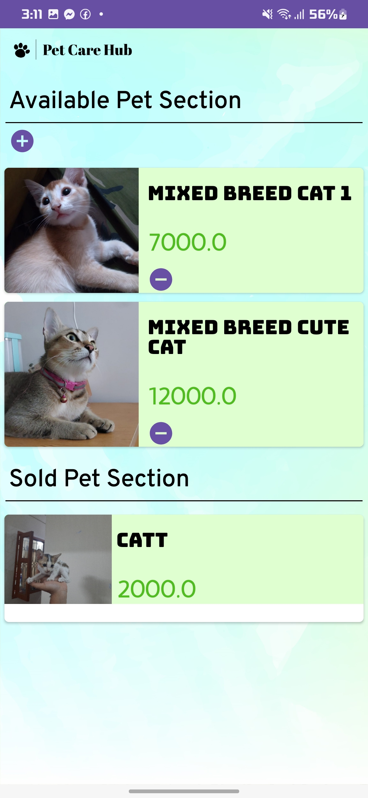
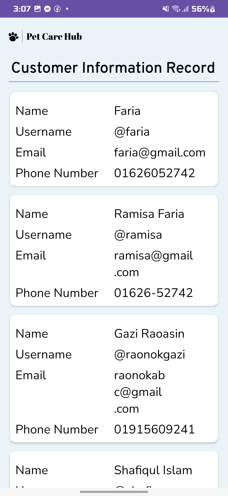
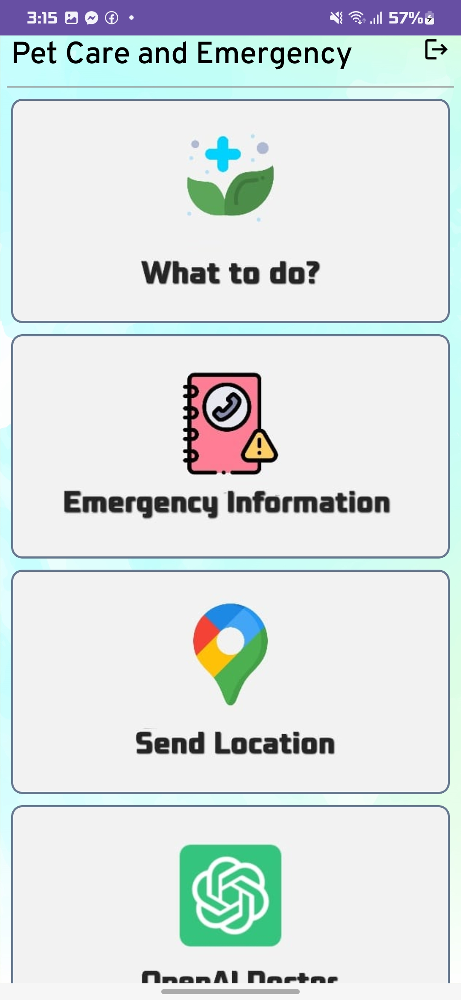
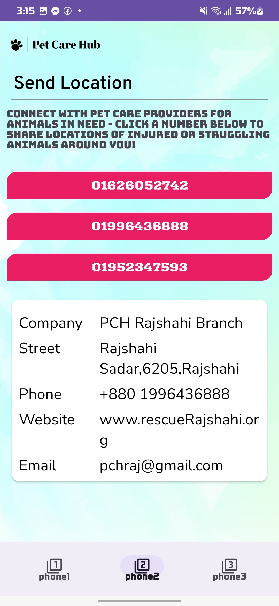
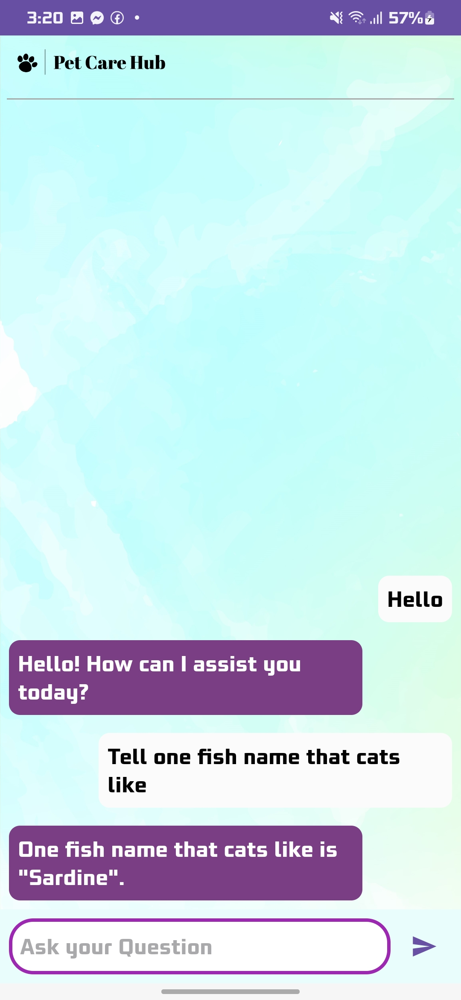
